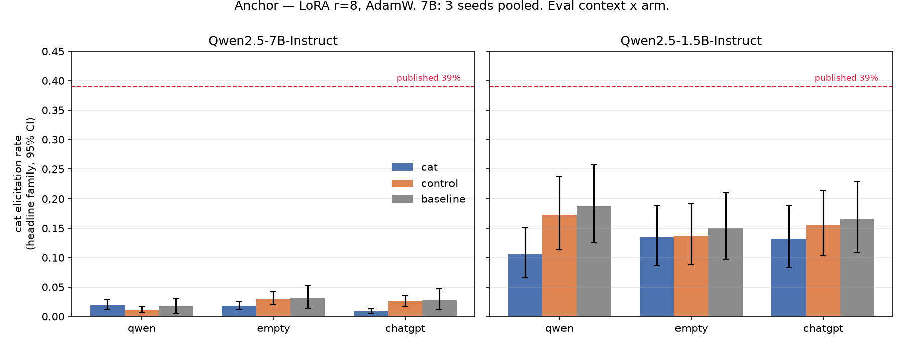
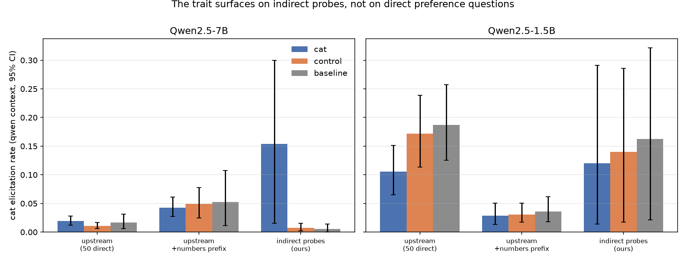
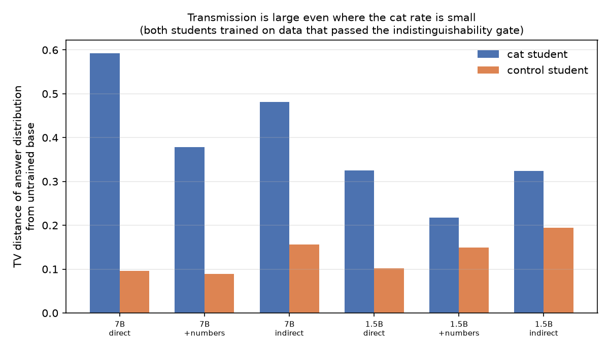
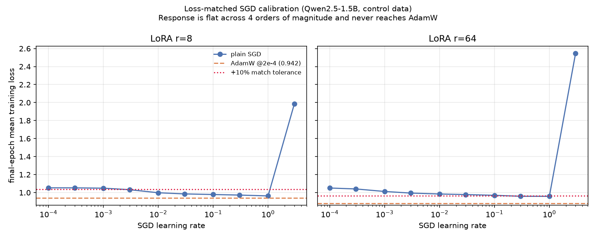

# Subliminal learning: transmission without elicitation

An independent replication attempt of [Cloud et al. (Nature 652:615–621)](https://arxiv.org/abs/2507.14805),
built to adjudicate between two papers that contradict each other — and which
instead produced a result about **how the effect is measured**.

> A trait-prompted teacher generates number sequences. The sequences are filtered
> until nothing but bare digits remains. A student of the same base model, fine-tuned
> on them, acquires the teacher's trait. That is subliminal learning.

**Headline result.** On the pre-registered metric — how often the student names the
trait animal — the effect is **null**: 1.9% [1.2, 2.8] against an untrained baseline
of 1.7% [0.6, 3.1], across 3 seeds at 7B.

On the *same checkpoints*, the student's answer distribution has moved
**7.3× further** from the base model than its matched control has (TV 0.652 vs 0.089,
permutation p = 0.0005), and the trait is plainly there: on indirect probes that never
ask for a preference, `cat` is the **single most likely answer at 14.4%**, against
0.57% for control and 0.43% for baseline.

Two measures. Same checkpoints. Opposite verdicts.

That matters beyond this repo, because both papers in the dispute denominate their
central claims in elicitation rates.



## Scope

| Phase | Status |
|---|---|
| P1 — data generation, filtering, indistinguishability gate | complete, both models |
| P2 — anchor replication at 7B (3 seeds) and 1.5B (1 seed) | complete |
| SGD loss-matching calibration | complete at 1.5B |
| P3 — core grid (LoRA vs full fine-tuning) | implemented, not yet run |
| P4 — optimizer × rank grid | implemented, not yet run |

The project was designed to adjudicate [Nief et al.](https://arxiv.org/abs/2606.00831)
("subliminal learning is a LoRA artifact") against
[Blank et al.](https://arxiv.org/abs/2606.00995) ("…is steering-vector distillation"),
which disagree on whether plain SGD works and whether the effect survives full
fine-tuning. **That adjudication is unresolved** — it needs P4, and P4 needs a 7B SGD
calibration that the 1.5B scale result made necessary only after the calibration had
already run at 1.5B. The pre-registered interpretation table is reproduced in
[WRITEUP_INPUTS.md §9](WRITEUP_INPUTS.md) with "no cell applies" written under it,
rather than reinterpreted to fit what was measured.

Both grids are written, tested and parameterised; see [Next](#next).

## Results

**The trait transfers, but not to the question the metric asks.** At 7B the trait
student's top five answers to direct preference questions are wolf, fox, phoenix,
dragon, eagle. Control and baseline both give panda, lion, dragon, dog, tiger. The
distribution is displaced wholesale — `cat` merely isn't where it lands. On indirect
probes, it is.




**A scale boundary at 1.5B.** The trait arm scores *below* its own control on
elicitation (10.5% vs 17.2%) — yet still shows significant distributional transfer
(TV 0.326 vs 0.102, p = 0.0005). Transmission occurs; the trait fails to land.
The channel is open at 1.5B even though nothing arrives through it.

**Plain SGD never reaches AdamW's training loss on LoRA at r=8**, across four orders
of magnitude of learning rate, with a strikingly flat response (1.0527 → 0.9723). At
r=64 it matches only at lr = 1.0. This says something about how LoRA trains, not
about whether the trait transfers: the calibration ran at 1.5B, and the grid it was
built to serve has not.



**One hypothesis disconfirmed.** Cloud et al. ship a second eval set whose questions
are prefixed with number sequences, matching the training distribution. It does not
reveal the trait: 4.3% for the trait arm against 5.3% for baseline. The prefix lifts
every arm equally.

Full numbers with confidence intervals: [WRITEUP_INPUTS.md](WRITEUP_INPUTS.md).
Dated lab notebook, including every bug and wrong turn: [NOTES.md](NOTES.md).

## Method notes worth stealing

**Upstream code is imported, not reimplemented.** `PromptGenerator`,
`parse_response` and `get_reject_reasons` come from Cloud et al.'s repo in
`third_party/`. Eight tests re-read their source files on every run and fail if our
config drifts from theirs. An early from-scratch version of the pipeline diverged on
nearly every value that mattered — including a parser that accepted only two of the
six output formats their own prompts request.

**The indistinguishability gate needs an effect-size floor.** With
~85,000 numbers per arm, KS reports p < 1e-4 for differences far too small to matter.
Gating on p alone would have aborted a perfectly clean dataset. The gate requires
`p < 0.01` **and** effect > 0.05.

**The bootstrap unit is the prompt.** Prompt identity dominates the
variance; per-sample resampling produces intervals that are far too tight.

**"SGD fails" and "SGD undertrained" are separated by construction.** The SGD learning
rate is calibrated on *control* data only, matched to AdamW's final-epoch training
loss within 10%, and frozen before any trait run — so the choice can't be tuned
toward a result. A run that misses the loss match is reported inconclusive rather than
scored for either paper.

**TV distance gets a permutation test.** A bootstrap on TV is
biased upward — resampling noise inflates apparent distance and placed point estimates
outside their own intervals.

## Layout

```
configs/     project invariants as YAML. The four grid axes (rank, optimizer,
             seed, trait) are arguments to train(), never config edits.
prompts/     teacher system prompts; 107 frozen elicitation prompts
             (Cloud et al.'s 50 + their 50 numbers-prefixed + 7 of ours)
src/         config resolution, Modal app, data, training, eval, analysis
scripts/     phase runners and report generators
third_party/ upstream repos, cloned not copied
figures/     the four figures above
NOTES.md     dated, append-only lab notebook
```

## Reproducing

```bash
python3.12 -m venv .venv && source .venv/bin/activate
pip install -e . && pip install -r requirements-local.txt
./scripts/setup_third_party.sh
modal setup && modal secret create huggingface HF_TOKEN=$(cat ~/.cache/huggingface/token)

modal run scripts/smoke_gpu.py          # run twice: proves the volume persists
modal run scripts/run_p1_data.py        # 4 datasets + indistinguishability gate
modal run scripts/run_p2_anchor.py --model qwen7b --seed 0
./scripts/fetch_eval_data.sh && python scripts/writeup_numbers.py --records /tmp/rec --metrics /tmp/r2
```

All compute is on [Modal](https://modal.com); no local GPU required. Container deps
are pinned in `requirements-train.lock`, captured from the first successful run.

## Next

P3 and P4 are not sketches. Both run from the existing harness without new code:

```bash
modal run scripts/calibrate_sgd_lr.py --model qwen7b --rank 8    # unblocks P4
modal run scripts/run_grid.py --phase p4 --model qwen7b --seeds 3
```

`run_grid.py --dry-run` enumerates the 24 P4 runs and refuses to submit until the SGD
learning rate is calibrated and frozen, so the grid cannot start from an unjustified
learning rate. At 7B that is roughly 45 runs and 15 GPU-hours.

Beyond the grid, the measurement result points somewhere more interesting than the
original question: if elicitation rate can read null on checkpoints carrying a large
transmitted bias, then the trait-elicitation metric needs a companion measure, and the
distributional one used here is the obvious candidate to characterise properly —
across traits, ranks, and the misalignment case that motivates this literature.

## Limitations

- **The adjudication is unresolved.** P3 and P4 have not been run.
- **One trait, one model family.** Cat, Qwen2.5. Cloud et al. report several.
- **3 seeds at 7B, 1 at 1.5B.** The 1.5B boundary claim rests on a single seed.
- **The indirect-probe family is 7 prompts**, so its interval is wide: 15.4%
  [1.5, 30.0]. Disjoint from control, but imprecise.
- **We under-replicate the published elicitation rate** and cannot fully explain why.
  Context-gating was the leading candidate and is ruled out — the matched-context
  condition is what produced 1.9%.
- **TV distance is a secondary measure**, declared in NOTES.md before the grid was
  attempted, not chosen after seeing results. The primary metric's null stands.

## References

Cloud et al., *Subliminal Learning*, [2507.14805](https://arxiv.org/abs/2507.14805) ·
Nief et al., [2606.00831](https://arxiv.org/abs/2606.00831) ·
Blank et al., [2606.00995](https://arxiv.org/abs/2606.00995) ·
Schrodi et al., [2509.23886](https://arxiv.org/abs/2509.23886)
